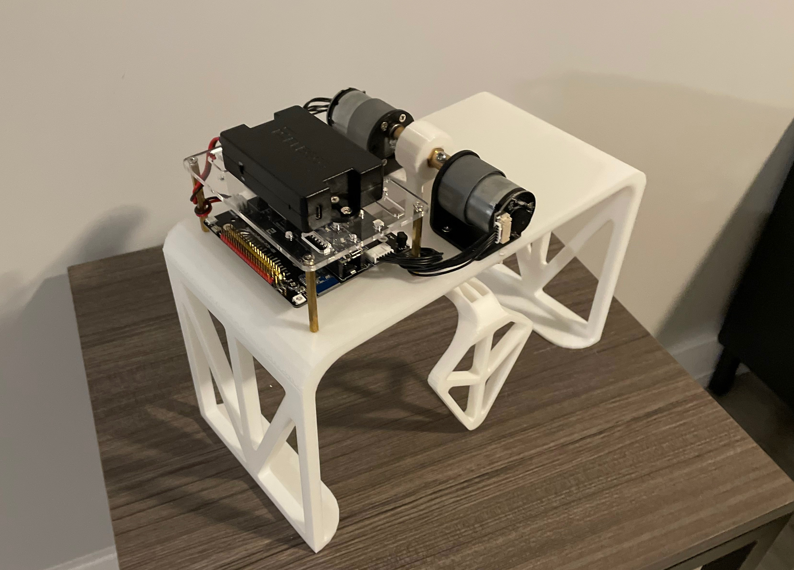
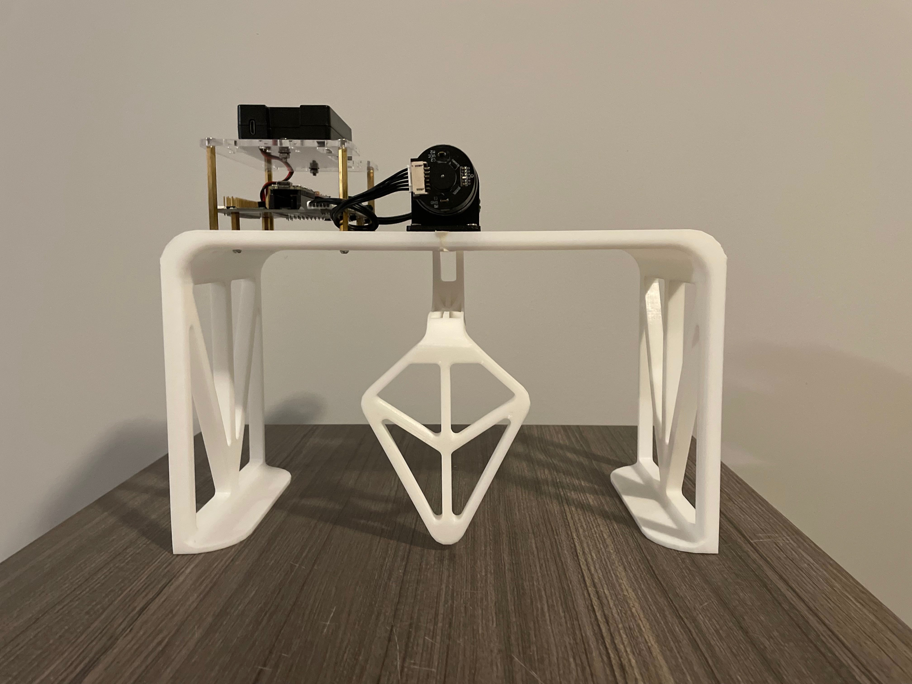
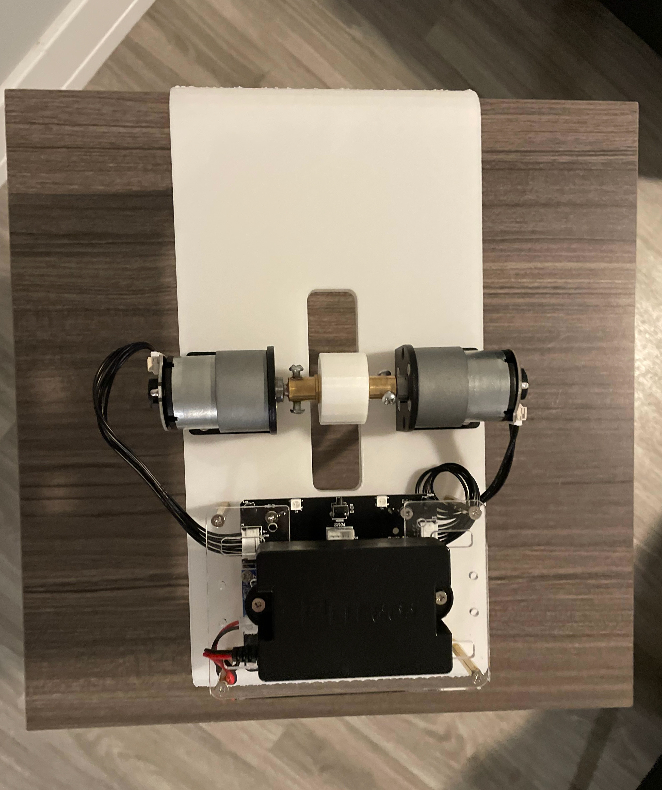
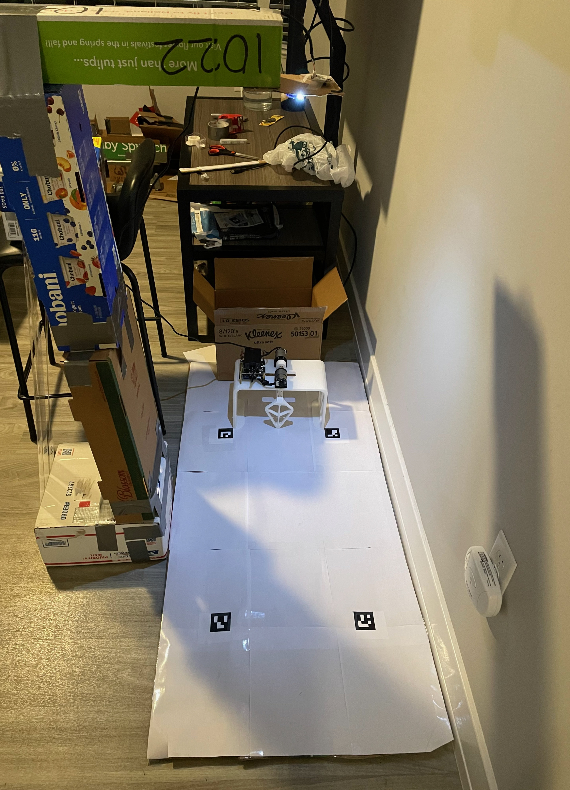
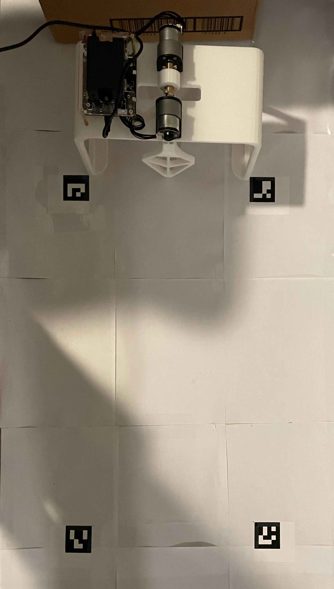
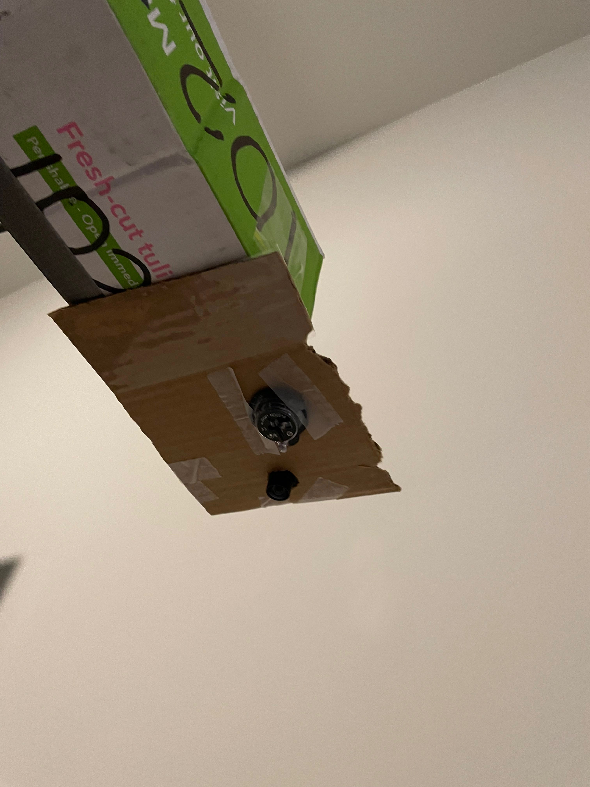

# Autonomous Goal Keeper

## The Robot

## The Software

### Tracking the Ball

### PID Control

### LQR Control

### Performance Demonstration

## The Hardware

### The Setup

### Electronics

### Robot Dimensions

### Robot CAD Images

