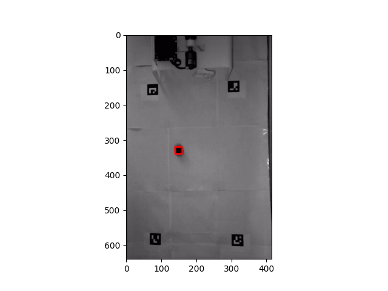

# Autonomous Goal Keeper
## The Project

The aim of this project was to create a robot that can autonomously detect a "soccer ball" and defend a goal. We aimed to use computer vision for ball tracking and popular control methods such as PID and LQR to accurately position the robot's arm. After considering the relevant constraints such as time and cost, we decided to build a scale model of the setup so we can demonstrate the core capabilities of our robot without building a full scale version.

## The Robot

## The Hardware

The robot was constructed using 3D-Printed parts as this was the most efficient way for us to prototype and manufacture the robot. At first we wanted to use a stick shaped goalie to block balls but found that this would perform poorly for several reasons. A thin stick shaped goalie would require much more precise inverse kinematics which would be difficult for a project with such a short time frame. We would need a lot of control over the arm which would be difficult given the inconsistencies that could be present with our computer vision algorithm. A rectangular goal also proved difficult to cover for a single linked revolute arm as it only moves in one dimension, but needs to be able to defend the xy-plane formed by the front face of the robot. We eventually arrived at the design as shown in the picture below, which allowed us to cover the entire goal, including all of the corners. The goalie blocker also has cutouts so that we are able to optimize the rotational inertia and achieve larger accelerations by the motor.

Most of the mounting hardware was recycled from the <a href="https://www.elegoo.com/collections/robot-kits/products/elegoo-tumbller-self-balancing-robot-car">Elegoo Tumbller</a>, which was the robot we used in labs in the past. This included 8 standoffs, 2 motor mounts, one plastic plate, and a few M3 screws. Although we designed the goal to be printed in 2 parts and glued together, we also used the motor mounts to strengthen the bridging by screwing it between the two halves. By mounting all of the hardware on top of the robot, we make the robot portable and easy to relocate to anywhere it might need to be. The two motors are set up in a counter-rotating configuration so that we are able to maximize the amount of availiable torque whilst still maintaining the maximum speed that we are able to reach. We chose to direct drive the motors as it was the most robust and simple design to implement given the time constraints.

### Electronics

The electronics of the robot are also mostly recycled from the Elegoo Tumbller. We used an Arduino Nano microcontroller to recieve and command joint positions to the two motors that came with the Elegoo kit. The motors have encoders which have 1560 ticks per revolution, enough resolution to allow us to have relatively high precision on the position of the motor. We also used the battery from the Elegoo kit to power our whole setup. A close up of our electronics is below.

Additionally, we used a camera rigged to provide a top view of the course as shown below. The camera uses a global shutter to minimize distortion and runs at roughly 37 fps. You can get the same camera <a href="https://www.amazon.com/Global-Shutter-Monochrome-Cameras-Windows/dp/B089QFRTVX/ref=sr_1_3?crid=137QCXP3HAXIZ&keywords=global+shutter+usb+camera&qid=1650942030&sprefix=global+shutter%2Caps%2C218&sr=8-3">here</a>, though we do recommend a different camera with a higher framerate if you able to get one. We light the scene using several lamps. This gives us much more controllable lighting conditions for thresholding in our computer vision.

### The Setup

We built the majority of the setup using cardboard. We first started by covering a large piece of cardboard with white paper to help our vision system more easily identify the ball. In hindsight, we would have used a color camera rather than a monochrome one as this made detecting the orange colored ping pong ball more difficult. We placed the camera roughly 5 feet above the ground so it is able to see most of the setup. We placed 4 ArUco markers in the corners of a rectangle to help our computer vision algorithm determine the location of the ball. Below are two pictures showing the full setup and what the view from the camera is roughly like (note that this was taken using a cell phone camera).

 

### Robot Dimensions

All dimensions are in millimeters.

 

### Robot CAD

All robot CAD is available on our github for 3D-printing (STL files only)

### Parts Used

 

## The Software

### Tracking the Ball

To compute the angle at which we should position the arm to block the ball, we need to know where the ball is going to end up in the horizontal direction, once it reaches the goal.

#### Finding the ball

We determine the location of the ball using a top down camera over the playing field. The raw images look like the following:

We painted the ball black to give it high contrast against the white playing field, which makes it easier to identify with computer vision. If you are not using a monochromatic camera like we did, you should be able to leave the ball its original color (orange) and you will find it much easier to threshold based on RGB or HSV values.

We use OpenCV to apply an adaptive gaussian threshold to the image, which yields the following:

We can then use OpenCV's contour detection to find contiguous regions of black pixels. We filter these contours by area, keeping only the ones within a pre-defined range. This helps us ignore contours that are too large or too small and reduces the number of false positives.

#### Computing the ball's position

Once we have identified one or more contours in the image, we can compute the position of each of these contours relative to the ArUco markers on the field, which are at known positions. We do so by using OpenCV's built-in ArUco marker detector. We can then compute a transformation from image space to world space and apply it to all of the identified contours.

Once we know the location of the contours in the real world, we can further filter them to exclude any which are not inside the rectangle defined by the markers. This reliably produces only a single location, corresponding to the ball.

In the following images, we draw a red rectangle with its center on where we believe the ball to be:

#### Estimating the ball's trajectory

Once we have the position of the ball over several frames, we can estimate its trajectory in order to predict where it will end up when it reaches the goal. If we only have a single frame of the ball so far, we simply use its x-coordinate in world space. Otherwise, we take up to the last 5 positions of the ball, and for each subsequent pair of positions, compute the velocity of the ball in world space. We take the average of these velocities, then solve for the ball's x-coordinate at the time that it would reach the y-coordinate of the goal. The following video visualizes this computation:

<iframe width="560" height="315" src="https://www.youtube.com/embed/EhwE5aTzZk0" title="YouTube video player" frameborder="0" allow="accelerometer; autoplay; clipboard-write; encrypted-media; gyroscope; picture-in-picture" allowfullscreen></iframe>

### LQR Control

We control the arm with an LQR controller, using the following linear model of the dynamics. Constant c0 represents a friction term, and constant c1 represents the impact of the control sent to the motor on its velocity.

We collected data by sending a sequence of commands to the robot and measuring the resulting angles over time. We then tuned constants c0 and c1 to match this data, which yielded c0=.05, c1=.004.

One issue we faced is that when we rapidly sent updates to the desired angle to the LQR controller, we observed unpredictable behavior. The following is a video in which we send updates with a 0.2s delay in-between. The robot behaves as expected:

[LQR with 0.2s delay](https://www.youtube.com/shorts/YelFhvKkZ9k)

However, if we send updates more rapidly, the controller behaves unexpectedly. The following is a video in which we send the updates with a 0.1s delay:

[LQR with 0.1s delay](https://youtube.com/shorts/VBRqGhC0dmI)

We have yet to solve this problem. TODO ADD OUR SOLUTION LATER

### Communication

Since the arm of the goal keeping robot is controlled by an arduino, it cannot read the images from the camera directly. Instead, our computer vision algorithm runs on a laptop connected to the USB camera as well as the arduino, over serial. The laptop reads images from the camera, computes the location of the ball on the board, computes the angle at which the arm should be set, and finally sends that desired angle over the serial port to the arduino. We used pyserial to establish the serial communications between the arduino and the computer. Upon receiving an update, the arduino LQR controller issues commands to the motors to achieve the desired angle.

## Performance Demonstrations

Below are some youtube videos showing how our robot performs under different circumstances.

[Ball on Stick](https://youtube.com/shorts/yKTe_psrHVw)

[Rolling Ball Success](https://youtube.com/shorts/OoNNkdcSWSA)

[Rolling Ball Failure](https://youtube.com/shorts/upyzuLVMyPU)

# Future Work

TODO